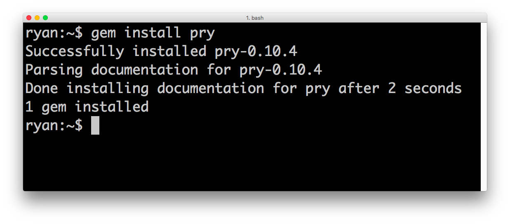

# IRB

The Interactive Ruby Shell (IRB) is one of the most important tools for a new
Rubyist. IRB allows one to quickly test code without having to create new files.
IRB is a type of *repl*, a read-eval-print loop. IRB reads single Ruby
expressions, evaluates them, and prints the result.

The `irb` command launches IRB. Within IRB, may can invoke basic ruby methods,
such as addition:

One may also assign variables:

Leave IRB by typing `exit`

## Pry

Pry is a slightly friendlier Ruby repl with color-coding and output-formatting.
Install pry by running:

`gem install pry`

Start pry with the `pry` command. Exit pry with the `exit`.

Oh, the colors! :)

