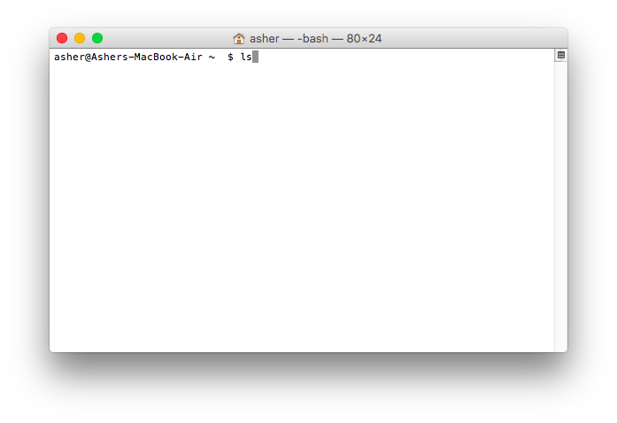

# Using the Terminal

The terminal is a command-line interface with the operating system.



Open a terminal window using Mac's built-in terminal application.

## Commands

Type a command into the terminal and press enter to execute a command. Note that
terminal commands are case sensitive.

Here are some of the most common terminal commands. A directory is synonymous
with a folder.

 Command | Definition              | Use this command to...
 ------- |:------------------------|------------------------------
 `pwd`   | print working directory | show you your current location
 `ls`    | list                    | show you what files/folders exist in your current location
 `cd`    | change directory        | move into and out of folders
 `mkdir` | make directory          | create a folder
 `clear` | (or command-K)          | clear the terminal output
 `ruby`  | ruby interpreter        | run a ruby file
 `irb`   | interactive ruby shell  | test small pieces of ruby code

---
### pwd

Many commands function in the context of the working directory. The `pwd`
command prints out the path of the current directory.


---
### ls

The `ls` command prints a list of the contents of a directory. It lists the
contents of the working directory by default.


---
### cd

The `cd` command changes the working directory. It allows one to navigate the
computer's directory structure. Use `cd` as follows:

 Command          | What it does
 ---------------- |:------------------------
 `cd some_folder` | Go into 'some_folder'
 `cd ..`          | Go up one folder
 `cd ../..`       | Go up two folders
 `cd ~`           | Go to the home directory
 `cd`             | Go to the home directory
 `cd /`           | Go to the root directory


---
### mkdir

The `mkdir` command creates a new directory at a given path. The default path is
the working directory. `mkdir my_new_directory` creates a new directory called
`my_new_directory` in the working directory. `mkdir
my_new_directory/another_new_directory` creates a new directory called
`another_new_directory` in `my_new_directory` which is itself in the working
directory.

By default, `mkdir` only creates a new directory within an existing directory.
The command will fail if you try to execute `mkdir funky/monkey` and `funky`
doesn't exist. The `-p` (for "parents") option, however, creates a directory
along with any nonexistent parent directories.. `mkdir -p funky/monkey` would
create both `funky` and `pics`.


---
### clear

`clear` clears all the text from the terminal.


---
### ruby

The `ruby` command allows one to run Ruby files. If you've saved a Ruby program
in a file called `terminal_fun.rb`, enter the command `ruby terminal_fun.rb` to
execute the program and print the results to the terminal. This is equivalent to
running a file in Repl.it


Any resultant errors will also be printed to the terminal.


---
## Tips and Tricks

### ctrl-C

If we run this ruby program, it will loop forever (more on that later!):

```ruby
def loop_forever
    while true
        puts "LOOPING FOREVER"
    end
end

```

Press 'ctrl-c' to interrupt the process. Use this command whenever a program runs
unexpectedly long.


### Tab Completion

Tab-completion saves a lot of time in the terminal. If you start typing
something in the terminal and press 'tab', the terminal will try to autocomplete
the rest of the word with matching commands and files. This feature is akin to
OSX's 'spotlight.' If you press 'tab' again, the terminal will display a list of
all possible matches.


### Command History

The terminal's command history feature also improves efficiency. While in the
terminal, press the 'up' and 'down' keys to cycle through prior commands.

### More Practice

Try these [exercises][terminal_exercises] for more practice! Then move onto the [IRB readings][irb]. Time to start writing and executing Ruby directly in the terminal!


[irb]: ./irb.md
[terminal_exercises]: ./terminal_exercises.md
